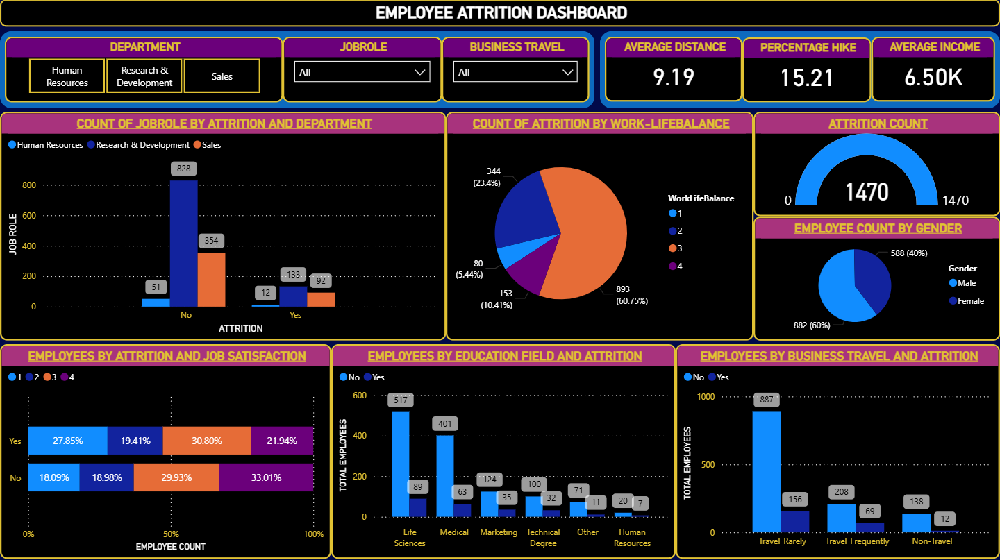

# Employee-Attrition

# 💼 Employee Attrition Analysis Using SQL and Power BI

> A data-driven HR analytics project that identifies patterns in employee attrition using SQL and visualizes insights in Power BI.

 
---

## 📌 Overview

This project explores factors contributing to employee attrition using SQL for data analysis and Power BI for visual storytelling. The insights can help HR departments take proactive steps to improve employee retention and work-life satisfaction.

---

## 🧰 Tools & Technologies

- **SQL Server** for data analysis and transformation
- **Power BI Desktop** for dashboarding and visualization
- **IBM HR Analytics Employee Attrition Dataset** (from Kaggle)

---

## 🧠 Objectives

- Understand which departments and roles have the highest attrition
- Identify risk indicators like OverTime, JobSatisfaction, WorkLifeBalance
- Rank departments by attrition rate
- Create a scoring model to flag at-risk employees

---

## 📂 Dataset

| Feature                | Description                            |
|------------------------|----------------------------------------|
| `Attrition`            | Whether the employee left (Yes/No)     |
| `Department`           | HR, R&D, or Sales                      |
| `JobRole`              | Role held by the employee              |
| `OverTime`             | Whether the employee works overtime    |
| `MonthlyIncome`        | Income of the employee                 |
| `JobSatisfaction`      | Satisfaction level (1 to 4)            |
| `WorkLifeBalance`      | Work-life balance rating (1 to 4)      |
| ...                    | 35 total features                      |

📥 Dataset: [IBM HR Analytics on Kaggle](https://www.kaggle.com/datasets/pavansubhasht/ibm-hr-analytics-attrition-dataset)

---

## 📈 Power BI Dashboard
The dashboard includes:
-	Overall Attrition Rate
-	Department-wise & Role-wise attrition
-	Attrition by Department and Gender
-	Attrition by Work Life Balance, Travel and Education Field
-	Filters for dynamic exploration

---

## 🧠 Key Insights
-	OverTime, low satisfaction, and short tenure increase attrition risk.
-	Sales and R&D have the highest attrition rates.
-	Employees with Risk Score ≥ 4 are highly likely to leave.

---

## 🚀 Future Work
-	Use Python to build a predictive model (e.g., Logistic Regression)
-	Add time-series attrition trends
-	Connect to live HR systems via SQL Server for real-time insights

---

## 📁 Files

-	emp_attrition/
├── EMP_ATTRITION_DASHBOARD.pbix
├── EMP_ATTRITION_PRESENTATION.pptx
├── Questions.docx
├── SQLQuery Level1.sql
├── SQLQuery Level2.sql
├── SQLQuery Level3.sql
├── dashboard.png
└── README.md

---

## Author

**Mihir Patil**  
Data Science Capstone Project
