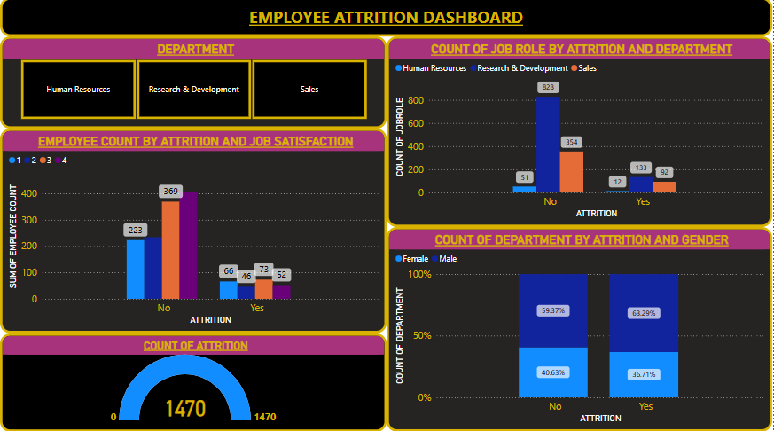

# Employee-Attrition

# 💼 Employee Attrition Analysis Using SQL and Power BI

> A data-driven HR analytics project that identifies patterns in employee attrition using SQL and visualizes insights in Power BI.

 
---

## 📌 Overview

This project explores factors contributing to employee attrition using SQL for data analysis and Power BI for visual storytelling. The insights can help HR departments take proactive steps to improve employee retention and work-life satisfaction.

---

## 🧰 Tools & Technologies

- **SQL Server** for data analysis and transformation
- **Power BI Desktop** for dashboarding and visualization
- **IBM HR Analytics Employee Attrition Dataset** (from Kaggle)

---

## 🧠 Objectives

- Understand which departments and roles have the highest attrition
- Identify risk indicators like OverTime, JobSatisfaction, WorkLifeBalance
- Rank departments by attrition rate
- Create a scoring model to flag at-risk employees

---

## 📂 Dataset

| Feature                | Description                            |
|------------------------|----------------------------------------|
| `Attrition`            | Whether the employee left (Yes/No)     |
| `Department`           | HR, R&D, or Sales                      |
| `JobRole`              | Role held by the employee              |
| `OverTime`             | Whether the employee works overtime    |
| `MonthlyIncome`        | Income of the employee                 |
| `JobSatisfaction`      | Satisfaction level (1 to 4)            |
| `WorkLifeBalance`      | Work-life balance rating (1 to 4)      |
| ...                    | 35 total features                      |

📥 Dataset: [IBM HR Analytics on Kaggle](https://www.kaggle.com/datasets/pavansubhasht/ibm-hr-analytics-attrition-dataset)

---

## 📊 Key SQL Insights

### 🔹 1. Total Attrition Count
```sql
SELECT COUNT(*) FROM hr_data WHERE Attrition = 'Yes';
